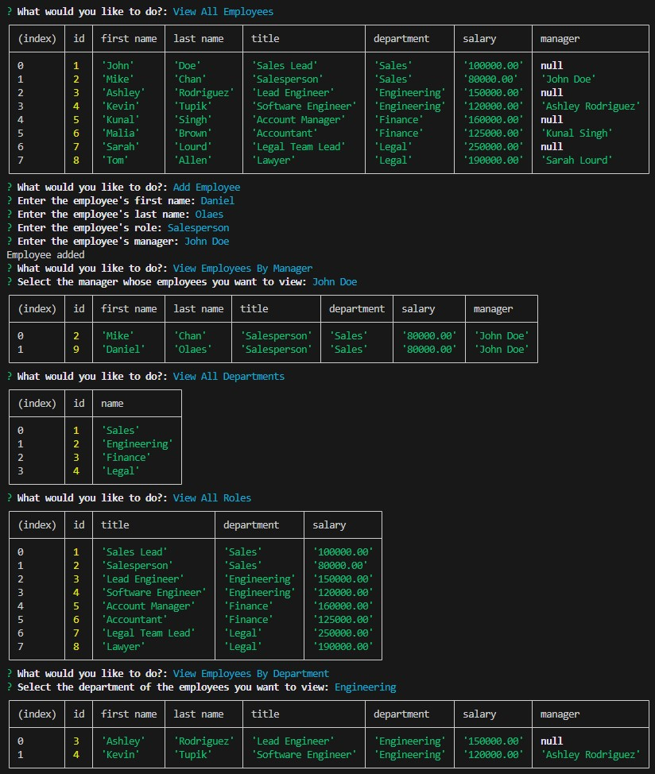

# Employee Tracker

## Description
As a business owner, the project allows you to view and manage the departments, roles, and employees in your company. You will be able to view all departments, view all roles, view all employees, view employees based on their manager, view employees based on their department, add new employees, add new roles, add new departments, update employees' role and update employees' managers.

## Table of Contents
- [Installation](#installation)
- [Usage](#usage)
- [Contributing](#contributing)
- [Tests](#test)
- [Questions](#questions)

## Installation
In order to install the project, please clone or download the repositiory found at https://github.com/dolaes/Employee-Tracker. Then please run "npm i" to download the required packages. Assuming that you already have PostgreSQL installed, open the terminal to the db directory, run "psql -U postgres". Within PostgreSQL run "\i schema.sql" and "\i seeds.sql". Lastly, alter the .env file according to your username and password.

## Usage
After completeing all of the installation steps, run "npm run build" followed by "npm run start" to launch the program. Within the program, you can use the arrow keys to navigate through the options to view and manipulate the employee database.

## Contributing
Project developed by Daniel Olaes.

## Tests
In order to test the program, utilize the add and update options to alter the database and utilize the view option to confirm that the changes are accurately reflected on the database.

## Questions
For questions, reach out at:
- GitHub: [dolaes](https://github.com/dolaes)
- Email: [danielolaes18@gmail.com](mailto:danielolaes18@gmail.com)